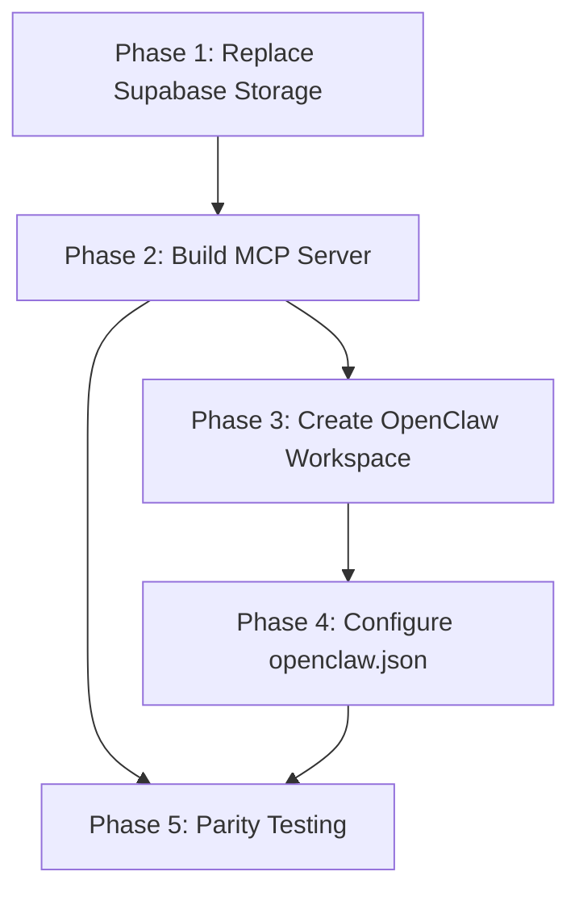

# OpenClaw Agent Setup — Implementation Plan

## Architecture Reference

Full architecture and workspace structure are documented in:

- [specs/006-openclaw-agent-setup/spec.md](specs/006-openclaw-agent-setup/spec.md) (20 FRs, 7 SCs)
- [specs/006-openclaw-agent-setup/architecture.md](specs/006-openclaw-agent-setup/architecture.md) (data flow, workspace files, DB migration)

## Phase 1: Replace Supabase Storage with Local FS

Supabase is used in **10 files** for storage only (upload, download, delete, public URL). The database is already Prisma-only.

**Core change**: Replace [src/lib/supabase.ts](src/lib/supabase.ts) with a new `src/lib/storage.ts` that implements the same interface (`uploadFile`, `deleteFile`, `getPublicUrl`, `downloadFile`) backed by local filesystem.

**Files to update** (swap `getSupabase().storage` calls to new `storage.ts`):

- [src/lib/pdf/merge.ts](src/lib/pdf/merge.ts) — `downloadPdfFromSupabase` becomes `downloadFile` from local FS
- [src/app/api/tests/[testId]/field-readings/route.ts](src/app/api/tests/[testId]/field-readings/route.ts)
- [src/app/api/tests/[testId]/field-readings/[fileId]/route.ts](src/app/api/tests/[testId]/field-readings/[fileId]/route.ts)
- [src/app/api/tests/[testId]/images/route.ts](src/app/api/tests/[testId]/images/route.ts)
- [src/app/api/tests/[testId]/images/[imageId]/route.ts](src/app/api/tests/[testId]/images/[imageId]/route.ts)
- [src/app/api/tests/[testId]/certificates/route.ts](src/app/api/tests/[testId]/certificates/route.ts)
- [src/app/api/tests/[testId]/certificates/[certId]/route.ts](src/app/api/tests/[testId]/certificates/[certId]/route.ts)
- [src/app/api/tests/[testId]/preview/route.ts](src/app/api/tests/[testId]/preview/route.ts)
- [src/app/api/tests/[testId]/pdf/route.ts](src/app/api/tests/[testId]/pdf/route.ts)

**Storage layout**: `/uploads/{site-images,field-readings,certificates,source-files}/`, `/generated/reports/`

**After**: Remove `@supabase/supabase-js` from `package.json`. Keep `DATABASE_URL` pointing to Neon or local PG (no Supabase connection string needed).

---

## Phase 2: Build PileTest MCP Server

Create `mcp-server/` directory at repo root as a standalone TypeScript package that imports from `src/lib/` and `src/engines/`.

We have pile test pro and similar skills already! Refer them.

### Structure

```
mcp-server/
  src/
    index.ts              -- MCP entry, stdio transport, register all tools
    tools/
      ingest-file.ts      -- wraps runAgentSwarm + parseExcelBuffer
      validate-test.ts    -- wraps getTestEngine().calculate + verifyTest
      generate-report.ts  -- wraps generateIvpltReportHtml + generatePDFWithPageNumbers + mergePdfs
      get-test.ts         -- wraps Prisma queries (test + readings + images + certs)
      store-file.ts       -- saves uploaded files to local FS + creates DB records
      attach-file.ts      -- associates file with test (siteImage/certificate/fieldReading)
      save-template.ts    -- saves project preset to DB (new Template model)
      apply-template.ts   -- loads preset and returns merged defaults
  package.json
  tsconfig.json
```

### Key wrapping decisions

- `ingest_file` — accepts file path or base64 bytes + mime type. Routes PDF/image to `runAgentSwarm`, Excel to `parseExcelBuffer`. Returns `expected.json`-shaped JSON with confidence scores.
- `validate_test` — accepts projectInfo + readings JSON. Calls `getTestEngine(testType).calculate()` then `verifyTest()`. Returns computation results + pass/fail + issues.
- `generate_report` — accepts `testId`. Reads everything from DB (SSOT). Calls template, chart gen, PDF gen, merge. Returns PDF as base64 or writes to `/generated/reports/`.
- `get_test` — accepts testId. Returns full Prisma include (readings, siteImages, fieldReadings, certificates).
- `store_file` / `attach_file` — accepts file bytes + testId + type. Writes to `/uploads/`, creates DB record.
- `save_template` / `apply_template` — requires a new `Template` Prisma model.

### Prisma schema addition

Add to [prisma/schema.prisma](prisma/schema.prisma):

```prisma
model Template {
  id             String   @id @default(uuid())
  name           String   @unique
  testType       TestType @default(IVPLT)
  client         String?
  contractor     String?
  pmc            String?
  location       String?
  pileDiameterMm Float?
  pileDepthM     Float?
  concreteGrade  String?
  designLoadT    Float?
  ramAreaCm2     Float?
  jackName       String?
  createdAt      DateTime @default(now())
  updatedAt      DateTime @updatedAt
}
```

### MCP SDK

Use `@modelcontextprotocol/sdk` TypeScript SDK with stdio transport (local MCP server pattern matching OpenClaw's `"command": "node"` config). Each tool registered with Zod input schemas.

---

## Phase 3: Create OpenClaw Workspace

Create `~/.openclaw/workspace-piletest/` with all config files. Content drafts are fully specified in [architecture.md lines 83-258](specs/006-openclaw-agent-setup/architecture.md).

**Files to create**:

- `IDENTITY.md` — name: PileTest, emoji: construction, role: leaf agent
- `SOUL.md` — geotech specialist persona, safety boundaries (never generate from unconfirmed data)
- `AGENTS.md` — strict 12-step conversation flow, template commands, non-pile-test file handling
- `USER.md` — primary user Niranjan, end users are Indian site engineers, IST timezone
- `TOOLS.md` — MCP server details, DB connection, file paths, supported test types
- `MEMORY.md` — starts empty, template for what entries should look like
- `HEARTBEAT.md` — check stale sessions, retry failed report generations
- `BOOTSTRAP.md` — first-run smoke test using training-data/report-001

**Skill installation**: Copy or symlink [.claude/skills/piletest-pro](.claude/skills/piletest-pro) to `~/.openclaw/workspace-piletest/skills/piletest-pro/`

---

## Phase 4: Configure openclaw.json

Add to `~/.openclaw/openclaw.json`:

1. New agent entry in `agents.list[]` — id: `piletest`, workspace path, model: `anthropic/claude-opus-4-6`, skills: `["piletest-pro"]`, MCP server config pointing to `mcp-server/dist/index.js`
2. New WhatsApp binding in `bindings[]` — route to piletest agent (by phone number or account ID)

---

## Phase 5: Parity Testing

Regression gate using existing [training-data/report-001](training-data/report-001):

1. Call `ingest_file` with `field-sheet/TP-01 BDD-No-3 IVPLT.pdf`
2. Compare extracted JSON vs [expected.json](training-data/report-001/expected.json) — target >= 95% field match
3. Call `validate_test` with expected data — verify computation values match
4. Call `generate_report` — verify PDF has correct sections, chart, data

**Smoke test script**: `mcp-server/scripts/parity-test.ts` that runs all 4 steps and reports pass/fail.

---

## Dependency Chain




Phase 1 must go first (MCP server cannot import merge.ts while it depends on Supabase). Phases 3 and 5 can partially overlap.