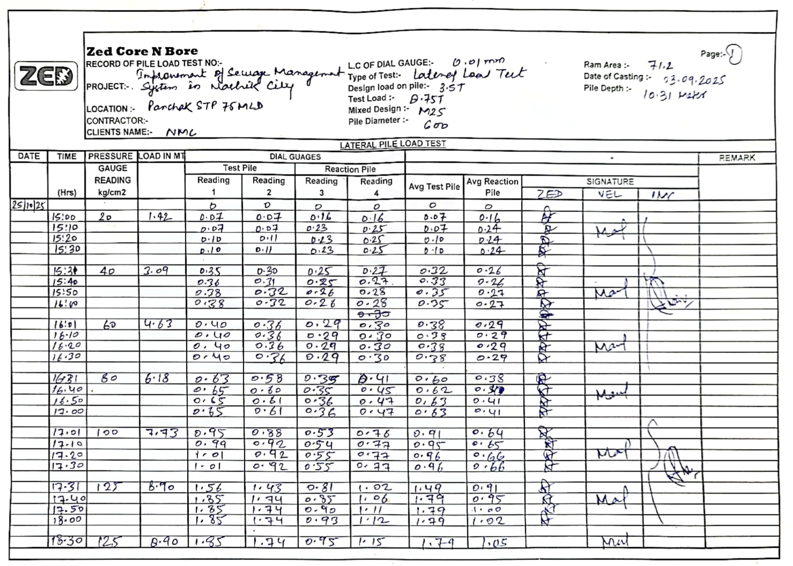

# Pile Load Test Image Extraction API — Requirements for Google AI Studio

> **Purpose:** Create an accurate image extraction API that converts handwritten pile load test field sheets into structured JSON data.

---

## 1. Project Context

### What is This?
**PileTest Pro** is a civil engineering application that transforms handwritten pile load test field readings into professional IS 2911-compliant reports. Site engineers photograph handwritten data sheets at construction sites, and this API extracts the data for report generation.

### Why Accuracy Matters
- **Structural Safety**: Inaccurate data can lead to structural failure
- **Regulatory Compliance**: Reports must comply with Indian Standard IS 2911 (Part 4)
- **Legal Liability**: These reports are official engineering documents

### Input Format
- **Images**: 1-3 photos of handwritten field note sheets per test
- **Format**: PNG, JPEG (typically 1-3 MB each)
- **Quality**: Variable — may include dust marks, faint pencil, scribbles, crossing out

---

## 2. Sample Input Image

Below is an annotated sample of what the input looks like:



### Key Regions to Extract:

**Header Section (Top of Page):**
| Field | Example Value | Location |
|-------|---------------|----------|
| Project Name | "Improvement of Sewage Management System in Nashik City" | Handwritten after "PROJECT:-" |
| Location | "Panchak STP 75 MLD" | After "LOCATION:-" |
| Client Name | "NMC" | After "CLIENTS NAME:-" |
| Ram Area | "71.2" | Top-right, labeled "Ram Area:-" |
| Type of Test | "Lateral Load Test" | After "Type of Test:-" |
| Design Load | "3.5T" | After "Design load on pile:-" |
| Test Load | "8.75T" | After "Test Load:-" |
| Pile Diameter | "600" | After "Pile Diameter:-" |
| Date of Casting | "03.09.2025" | After "Date of Casting:-" |
| Pile Depth | "10.31 Mtrs" | After "Pile Depth:-" |
| L.C. of Dial Gauge | "0.01 mm" | After "L.C OF DIAL GAUGE:-" |
| Mixed Design (Concrete Grade) | "M25" | After "Mixed Design:-" |

**Data Table Section (Main Body):**
| Column | Description | Data Type |
|--------|-------------|-----------|
| DATE | Test date (e.g., "25/10/25") | Date |
| TIME (Hrs) | 24-hour time (e.g., "15:00", "16:31") | Time string |
| PRESSURE GAUGE READING kg/cm² | Hydraulic pressure (e.g., 20, 40, 60, 80, 100, 125) | Number |
| LOAD IN MT | Applied load in Metric Tonnes | Number |
| Test Pile Reading 1 | Dial gauge 1 reading (mm) | Decimal |
| Test Pile Reading 2 | Dial gauge 2 reading (mm) | Decimal |
| Reaction Pile Reading 3 | Dial gauge 3 reading (mm) | Decimal (Lateral tests only) |
| Reaction Pile Reading 4 | Dial gauge 4 reading (mm) | Decimal (Lateral tests only) |
| Avg Test Pile | Average of gauges 1 & 2 | Decimal |
| Avg Reaction Pile | Average of gauges 3 & 4 | Decimal (Lateral tests only) |

---

## 3. Test Types

The API must handle 4 types of pile load tests:

| Test Type | Code | Description | Key Difference |
|-----------|------|-------------|----------------|
| Initial Vertical | IVPLT | Static vertical load test on initial piles | 4 dial gauges (settlement) |
| Routine Vertical | RVPLT | Routine vertical load test | 4 dial gauges (settlement) |
| Pullout/Uplift | PULLOUT | Measures uplift capacity | 4 dial gauges (uplift movement) |
| Lateral | LATERAL | Horizontal load test | 2 Test Pile gauges + 2 Reaction Pile gauges |

**Detection Hint:** Look for "Type of Test" in header OR presence of "Reaction Pile" columns.

---

## 4. Required Output Schema

```json
{
  "project_info": {
    "project_name": "string | null",
    "location": "string | null",
    "client": "string | null",
    "contractor": "string | null",
    "pile_id": "string | null",
    "test_type": "Vertical | Lateral | Pullout | null"
  },
  "technical_specs": {
    "pile_diameter_mm": "number | null",
    "pile_depth_m": "number | null",
    "jack_ram_area_cm2": "number | null",
    "test_load_mt": "number | null",
    "design_load_mt": "number | null",
    "grade_of_concrete": "string | null",
    "date_of_casting": "string (YYYY-MM-DD) | null",
    "date_of_testing": "string (YYYY-MM-DD) | null",
    "lc_dial_gauge": "string | null"
  },
  "readings": [
    {
      "row_id": "integer (sequential, starting from 1)",
      "phase": "Loading | Holding | Unloading",
      "date": "string (YYYY-MM-DD) | null",
      "time_recorded": "string (HH:MM in 24hr format)",
      "pressure_gauge_reading_kg_cm2": "number | null",
      "load_applied_mt": "number | null",
      "test_pile_deflection": {
        "dial_1_mm": "number | null",
        "dial_2_mm": "number | null",
        "dial_3_mm": "number | null",
        "dial_4_mm": "number | null",
        "average_mm": "number | null"
      },
      "reaction_pile_deflection": {
        "dial_1_mm": "number | null",
        "dial_2_mm": "number | null",
        "average_mm": "number | null"
      },
      "remarks": "string | null",
      "confidence": "number (0.0-1.0)"
    }
  ]
}
```

### Field Mapping Details:

| Image Label | JSON Field | Notes |
|-------------|------------|-------|
| "Ram Area:-" | `technical_specs.jack_ram_area_cm2` | Critical for validation |
| "Design load on pile:-" | `technical_specs.design_load_mt` | Parse number, ignore "T" or "MT" |
| "Test Load:-" | `technical_specs.test_load_mt` | Parse number only |
| "Pile Diameter:-" | `technical_specs.pile_diameter_mm` | Usually in mm |
| "Pile Depth:-" | `technical_specs.pile_depth_m` | Usually in meters |
| "Mixed Design:-" | `technical_specs.grade_of_concrete` | E.g., "M25", "M35" |
| "Type of Test:-" | `project_info.test_type` | Map to enum values |
| Table column "Reading 1" | `test_pile_deflection.dial_1_mm` | Under "Test Pile" |
| Table column "Reading 2" | `test_pile_deflection.dial_2_mm` | Under "Test Pile" |
| Table column "Reading 3" | `reaction_pile_deflection.dial_1_mm` | Under "Reaction Pile" (Lateral only) |
| Table column "Reading 4" | `reaction_pile_deflection.dial_2_mm` | Under "Reaction Pile" (Lateral only) |

---

## 5. Validation & Error Correction Logic

### 5.1 Physics Validation (CRITICAL)

**Formula: Load = (Pressure × Ram Area) / 1000**

```
Load (MT) = Pressure (kg/cm²) × Ram Area (cm²) ÷ 1000
```

**Example:**
- If Pressure = 100 kg/cm², Ram Area = 71.2 cm²
- Then Load = (100 × 71.2) / 1000 = 7.12 MT

**Validation Rule:**
- Calculate expected load from pressure
- If extracted load differs by >5%, flag the row with `confidence: 0.5`
- Common error: Misreading "7.12" as "71.2" (decimal point issues)

### 5.2 Time Chronology Validation

**Rule:** Time always moves forward within a test cycle.

**Example Error to Catch:**
```
10:30 → 10:45 → 19:00 ❌ (Should be 11:00)
```
- If time appears to jump backwards or forward by hours, likely OCR error
- "19:00" is probably "11:00" or "10:00" misread

### 5.3 Settlement Continuity

**During Loading Phase:**
- Settlement (dial readings) should generally INCREASE as load increases
- If dial reading suddenly DROPS during loading, it's likely an OCR error

**Example:**
```
Row 1: Dial 1 = 5.45 mm, Load = 100 MT
Row 2: Dial 1 = 0.46 mm, Load = 150 MT ❌ (Should be 5.46 or 6.46)
```

### 5.4 Phase Detection

Determine phase from load progression:
- **Loading**: Load values increasing
- **Holding**: Load values constant (same value repeated)
- **Unloading**: Load values decreasing

---

## 6. Handwriting Disambiguation Rules

| Character | Often Misread As | Context Clue |
|-----------|-----------------|--------------|
| `0` (zero) | `6`, `C`, `-` | If first reading of test, `-` = 0.00 |
| `5` | `S`, `3` | Check if number fits pattern |
| `1` | `7`, `\|` | Look at adjacent characters |
| `7` | `1`, `7` | Context: Is 71.2 a valid ram area? |
| `.` (decimal) | Missing entirely | Load values usually have 2 decimals |
| `2` | `7`, `Z` | Common in dial readings |

### Special Cases:

**Dash (`-`) Interpretation:**
- First row: `-` usually means `0.00` (initial zero reading)
- Middle rows: `-` usually means "same as above" or missing data

**Crossed-out Values:**
- If a value is crossed out with a new value written, use the NEW value
- Flag confidence as lower (0.7)

---

## 7. Multi-Image Handling

Tests often span 2-3 pages. The API should:

1. **Maintain Row Continuity**: Row numbering continues across pages
2. **Detect Page Boundaries**: Look for "Page: 1", "Page: 2" markers
3. **Merge Data**: Combine readings from all pages into single `readings` array
4. **Header Consistency**: Header info should come from first page only

---

## 8. Example Output

For the sample image shown above, the expected output is:

```json
{
  "project_info": {
    "project_name": "Implementation of Sewage Management System in Nashik City",
    "location": "Panchak STP 75 MLD",
    "client": "NMC",
    "contractor": null,
    "pile_id": "TP-05",
    "test_type": "Lateral"
  },
  "technical_specs": {
    "pile_diameter_mm": 600,
    "pile_depth_m": 10.31,
    "jack_ram_area_cm2": 71.2,
    "test_load_mt": 8.75,
    "design_load_mt": 3.5,
    "grade_of_concrete": "M25",
    "date_of_casting": "2025-09-03",
    "date_of_testing": "2025-10-25",
    "lc_dial_gauge": "0.01 mm"
  },
  "readings": [
    {
      "row_id": 1,
      "phase": "Loading",
      "date": "2025-10-25",
      "time_recorded": "15:00",
      "pressure_gauge_reading_kg_cm2": 20,
      "load_applied_mt": 1.42,
      "test_pile_deflection": {
        "dial_1_mm": 0.07,
        "dial_2_mm": 0.07,
        "dial_3_mm": null,
        "dial_4_mm": null,
        "average_mm": 0.07
      },
      "reaction_pile_deflection": {
        "dial_1_mm": 0.16,
        "dial_2_mm": 0.16,
        "average_mm": 0.16
      },
      "remarks": null,
      "confidence": 0.95
    },
    {
      "row_id": 2,
      "phase": "Loading",
      "date": "2025-10-25",
      "time_recorded": "15:10",
      "pressure_gauge_reading_kg_cm2": 20,
      "load_applied_mt": 1.42,
      "test_pile_deflection": {
        "dial_1_mm": 0.07,
        "dial_2_mm": 0.07,
        "dial_3_mm": null,
        "dial_4_mm": null,
        "average_mm": 0.07
      },
      "reaction_pile_deflection": {
        "dial_1_mm": 0.23,
        "dial_2_mm": 0.25,
        "average_mm": 0.24
      },
      "remarks": null,
      "confidence": 0.95
    }
  ]
}
```

---

## 9. Confidence Scoring Guidelines

Assign confidence scores based on:

| Condition | Confidence |
|-----------|------------|
| Clear, unambiguous reading | 0.95 |
| Slightly smudged but readable | 0.85 |
| Ambiguous character (could be two values) | 0.70 |
| Physics validation mismatch | 0.50 |
| Crossed out / corrected value | 0.60 |
| Missing or illegible | 0.00 (value = null) |

---

## 10. API Requirements

### Request Format
```
POST /extract
Content-Type: multipart/form-data

images[]: File[] (1-3 images)
```

### Response Format
```json
{
  "success": true,
  "data": { /* Schema from Section 4 */ },
  "metadata": {
    "processing_time_ms": 1234,
    "pages_processed": 2,
    "total_readings_extracted": 45,
    "average_confidence": 0.87,
    "validation_warnings": [
      "Row 12: Load/Pressure mismatch - calculated 7.12 MT, found 71.2 MT"
    ]
  }
}
```

### Error Response
```json
{
  "success": false,
  "error": {
    "code": "UNREADABLE_IMAGE",
    "message": "Could not extract data from image - too blurry or low contrast"
  }
}
```

---

## 11. Test Cases to Validate

| Test Case | Description | Expected Behavior |
|-----------|-------------|-------------------|
| Clear handwriting | Well-written field sheet | >90% confidence on all fields |
| Faint pencil | Light pencil strokes | Extract with lower confidence |
| Crossed-out values | Corrections made on sheet | Use new value, flag lower confidence |
| Multi-page test | 3-page test log | Merge all readings sequentially |
| Lateral test | Has reaction pile columns | Populate `reaction_pile_deflection` |
| Vertical test | No reaction pile columns | `reaction_pile_deflection` = null for all rows |
| Date format DD/MM/YY | Indian date format | Convert to YYYY-MM-DD correctly |
| Time without colon | "1530" instead of "15:30" | Parse as "15:30" |
| Zero readings | First row with "-" or "0" | Interpret as 0.00 |

---

## 12. Additional Sample Images

Find more sample images in the repository:
- `lateral-test-data/lateral-test-image-one.png` - Lateral test page 1
- `lateral-test-data/lateral-test-image-two.png` - Lateral test page 2
- `all-hand-readings.pdf` - Multi-page vertical test

---

## 13. Common Pitfalls to Avoid

1. **Don't assume uniform time intervals** - Readings may be 10, 15, 30, or 60 min apart
2. **Don't skip "holding" rows** - Same load repeated means holding phase, not duplicate
3. **Watch for page numbers** - Don't re-extract header on subsequent pages
4. **Indian date format** - DD/MM/YYYY, not MM/DD/YYYY
5. **Decimal points** - Critical for dial readings (0.07 vs 0.7 vs 7.0)
6. **Load column may be blank** - Some sheets only show pressure, calculate load from formula
7. **Ram Area location varies** - Could be top-left, top-right, or in a table header

---

## 14. Summary Prompt for AI Studio

```
You are extracting pile load test data from handwritten engineering field notes.

INPUT: 1-3 images of field reading sheets
OUTPUT: Structured JSON per the provided schema

KEY RULES:
1. Extract ALL header fields (project, location, pile specs, etc.)
2. Extract EVERY row from the data table
3. Validate: Load = (Pressure × Ram Area) / 1000
4. Time moves forward chronologically
5. Settlement increases during loading phase
6. Assign confidence scores based on readability
7. For Lateral tests, populate reaction_pile_deflection
8. Convert dates to YYYY-MM-DD format
9. Convert times to HH:MM 24-hour format
10. Return ONLY valid JSON, no markdown or commentary
```

---

## 15. Contact / Questions

For clarification on edge cases or additional sample images, refer to:
- IS 2911 Part 4 (Indian Standard for Pile Load Testing)
- Sample reports in `these-are-the-reports-to-automate/` folder


